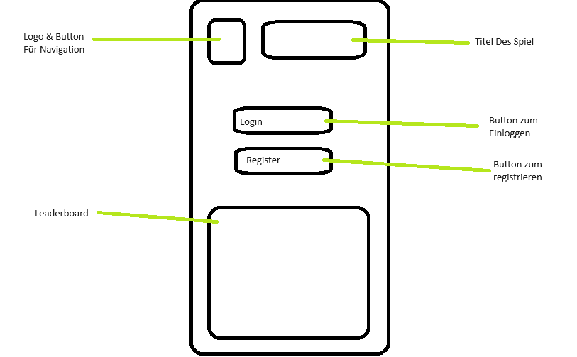
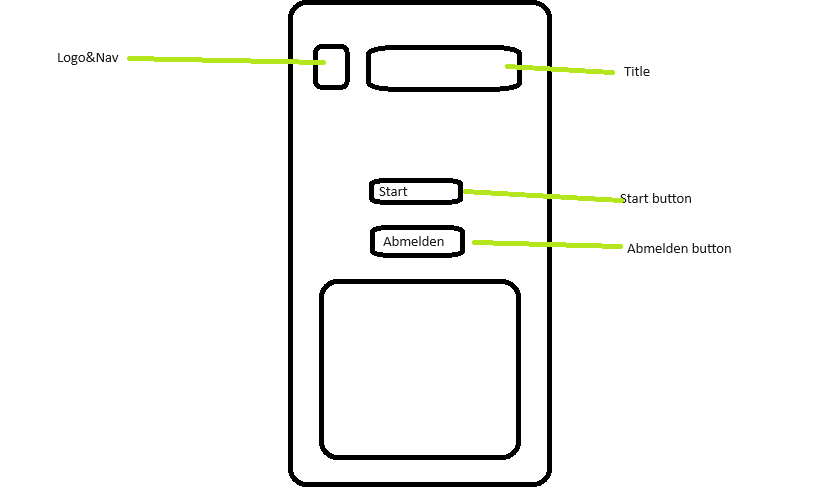
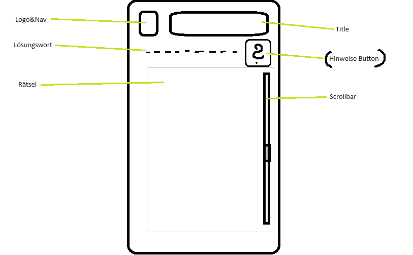

# 👾🙄🤷 codeknacker ⌨️🤔🤷🏿‍♀️
Welcome to **codeknacker**, a game developed with JavaScript, [React](https://react.dev) for dynamic user interfaces and [Vite](https://vitejs.dev) for lightning-fast development.  
Click [👉 here](https://annagraphic.github.io/codeknacker) for the game.  
*Psst! Because it's you, here are the credentials: user: 'Harry', pwd: '123'* 😸

## TODOs

- [ M ] game logic
- [X] components
  - [X] Header
    - [X] Navigation (e.g. Dropdon)
      - [X] add logout
  - Logout
    - [X] debug logout button in dropdown
  - [X] Login
    -[X] loading spinner
    -[X]focus
  - [ M ] Game
    - [X] update score in userContext
  - [X] Profile
    - [X] change dummy data to userContext
    - [ ] upload function for profile pic
    - [ ] change username to display name
  - [X] Leaderboard
      - [ ] replace dummy data
- [X] Browser Router
- [X] index.css
  - [X] find colors
  - [X] find font
  - [X] px convert to em/rem
- [x] routing
  - [X] add fallback-route
  - [X] after login: go to game
- [X] contexts:
  - [x] change loginReducer to userReducer
- [X] add intro to README
- [X] deployment
## next steps:
  - [🐼] database
  - [ ] connect to backend
## Spielablaufplan

### Startseite

- Der Benutzer wird auf die Startseite weitergeleitet.
- Die Startseite enthält ein Login- oder Registrierungsfeld sowie den Spielnamen.
- Der Benutzer kann sich anmelden oder registrieren.

### Login- oder Registrierungsprozess

- Der Benutzer gibt seine Anmeldedaten ein oder erstellt ein neues Konto.
- Der Benutzer wird auf die Startseite weitergeleitet, wenn die Anmeldung oder Registrierung erfolgreich ist.

### Startbildschirm

- Der Benutzer wird auf den Startbildschirm weitergeleitet.
- Der Startbildschirm enthält eine kurze Spielbeschreibung und zwei Schaltflächen: "Start" und "Einstellungen".

### Start

- Der Benutzer klickt auf die "Start"-Schaltfläche.
- Das Spiel beginnt.
- Das Spiel zeigt ein Rätsel an.
- Das Rätsel enthält ein Wort mit leeren Feldern.
- Jedes leere Feld hat eine Zahl daneben.

### Rätsel lösen

- Der Benutzer wählt einen Buchstaben aus.
- Der Buchstabe wird in einem der leeren Felder eingefügt.
- Das Rätsel wird aktualisiert.
- Der Benutzer wiederholt diese Schritte, bis er das Wort vollständig gelöst hat.

### Punkte

- Für jeden Buchstaben im Lösungswort erhält der Benutzer Punkte.

### Nächstes Level

- Wenn der Benutzer das Wort löst, wird er zum nächsten Level weitergeleitet.

### Beenden

- Der Benutzer kann das Spiel jederzeit beenden.

### ( Hilfe )

- Wenn der Benutzer nicht weiterkommt, kann er auf die "Hilfe"-Schaltfläche klicken.
- Die "Hilfe"-Schaltfläche zeigt einen Buchstaben im Rätsel an.

### Technische Umsetzung

- Die Startseite wird mit React erstellt.
- Die Rätsel werden aus einer MongoDB-Datenbank geladen.
- Die Punkte werden in der Datenbank gespeichert.

### Weitere Ideen

- Das Spiel könnte mit einem Leaderboard ausgestattet werden, in dem die Spieler ihre Punktzahlen vergleichen können.
- Das Spiel könnte mit einem Fortschrittssystem ausgestattet werden, in dem die Spieler neue Levels freischalten können.
- Das Spiel könnte mit einem Multiplayer-Modus ausgestattet werden, in dem zwei Spieler gegeneinander antreten können.
